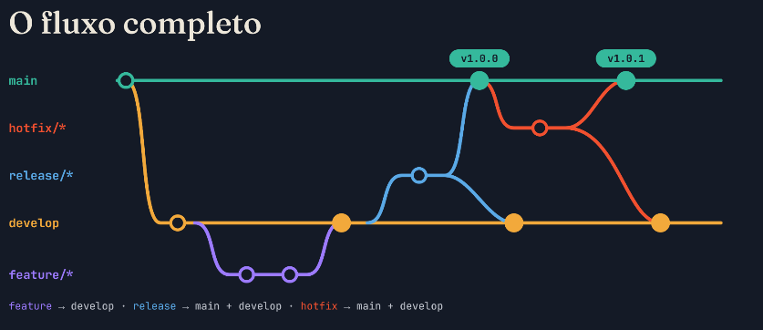

Duas fixas e três de apoio:

| Branch | Sai de | volta para | para quê? |
| :--- | :---: | :---: | :--- |
| main | - | - | Código em produção. Cada merge é uma versão |
| develop | main | - | Integração do que vai para a proxima versão |
feature/* | develop | develop | Uma funcionalidade nova |
realease/* | develop | main + develop | Prepara a versão: Ajustes finos e número |
hotfix/* | main | main + develop | Correção urgente em produção |

